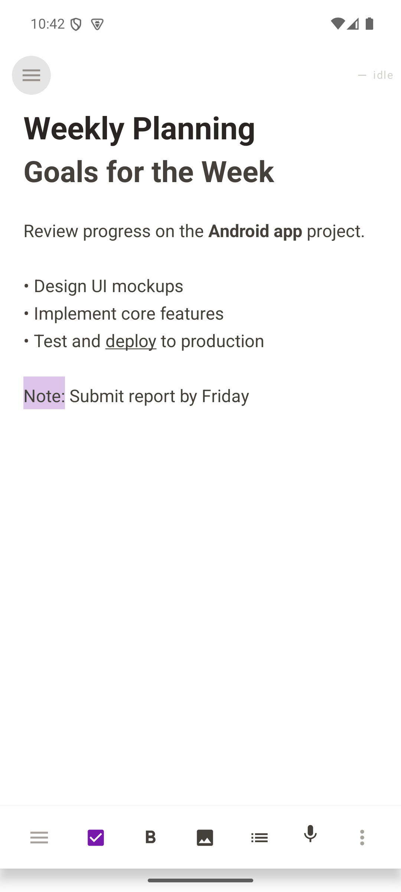
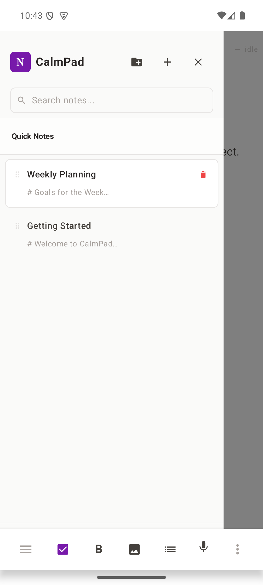
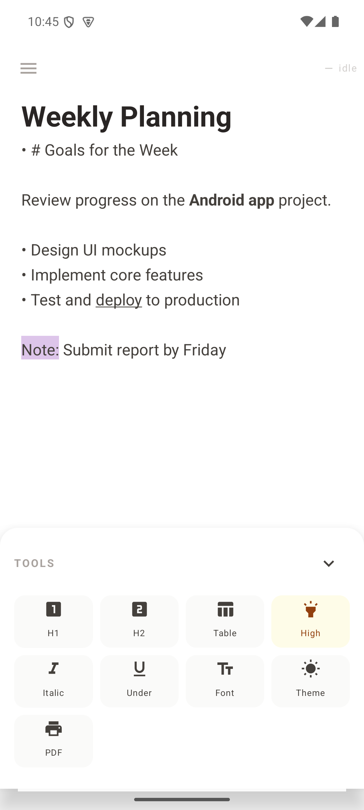
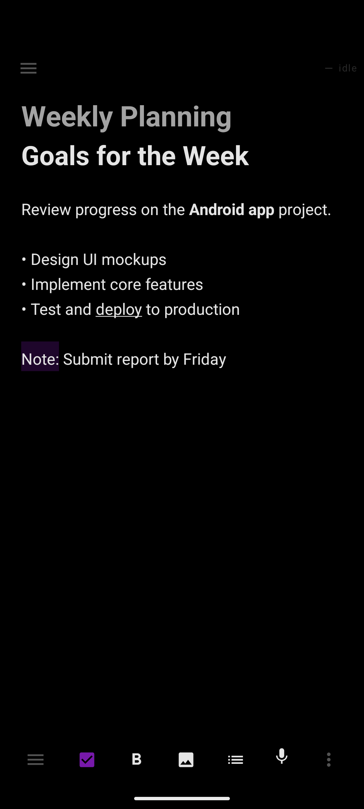

# CalmPad

A calm, minimal note-taking Android app inspired by [CalmPad](https://haikubits.github.io/selfhosting/calmpad/).

## Screenshots

<p align="center">
  
  
  
  
</p>

## Features

- **Rich text formatting** - H1/H2 headings, bold, italic, underline, highlight, bullet lists
- **Image embedding** - Pick images from gallery; stored in app-private storage and rendered inline
- **Voice typing** - Tap the mic button to dictate text via speech recognition
- **PDF / Print** - Export individual notes or the entire notebook to PDF with embedded images
- **Sections** - Organize notes into named tabs/sections
- **Drag-and-drop reorder** - Long-press to move notes within a section
- **Full-text search** - Search across all notes instantly
- **4 Themes** - Light, Sepia, Dim, Dark
- **3 Fonts** - Sans, Serif, Mono
- **Auto-save** - Debounced saves with saved status indicator
- **Version history** - Keeps last 5 snapshots per note
- **Backup / Import** - JSON export and import for portability

## Tech Stack

- Kotlin + Jetpack Compose (Material 3)
- Room Database for storage
- DataStore Preferences for settings
- Hilt for dependency injection
- Coil for image loading
- MVVM architecture

## Build

```
./gradlew assembleDebug
```

## Download

See [Releases](https://github.com/SharmaAjay19/Calmpad/releases) for the latest APK.
